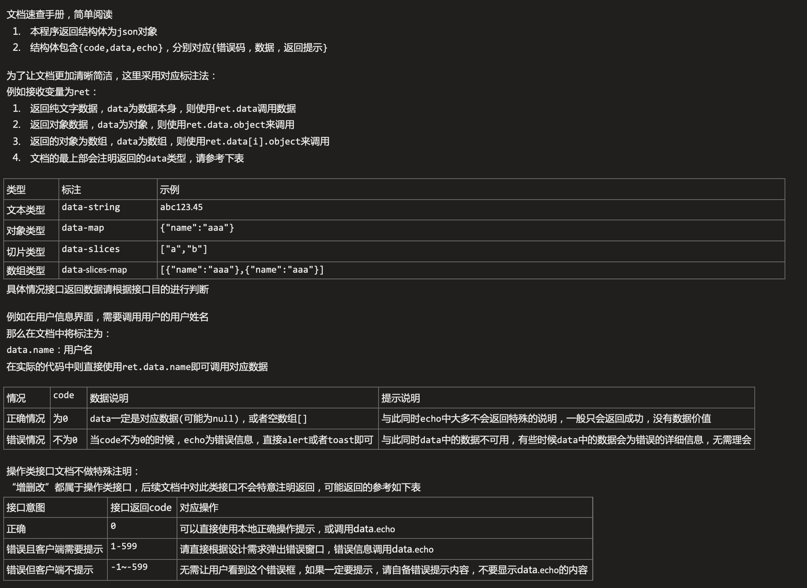

文档速查手册，简单阅读
	1. 本程序返回结构体为json对象
	2. 结构体包含{code,data,echo}，分别对应{错误码，数据，返回提示}

为了让文档更加清晰简洁，这里采用对应标注法：
例如接收变量为ret：
	1. 返回纯文字数据，data为数据本身，则使用ret.data调用数据
	2. 返回对象数据，data为对象，则使用ret.data.object来调用
	3. 返回的对象为数组，data为数组，则使用ret.data[i].object来调用
	4. 文档的最上部会注明返回的data类型，请参考下表

类型	标注	示例
文本类型	data-string	abc123.45
对象类型	data-map	{"name":"aaa"}
切片类型	data-slices	["a","b"]
数组类型	data-slices-map	[{"name":"aaa"},{"name":"aaa"}]
具体情况接口返回数据请根据接口目的进行判断

例如在用户信息界面，需要调用用户的用户姓名
那么在文档中将标注为：
data.name：用户名
在实际的代码中则直接使用ret.data.name即可调用对应数据

情况	code	数据说明	提示说明
正确情况	为0	data一定是对应数据(可能为null)，或者空数组[]	与此同时echo中大多不会返回特殊的说明，一般只会返回成功，没有数据价值
错误情况	不为0	当code不为0的时候，echo为错误信息，直接alert或者toast即可	与此同时data中的数据不可用，有些时候data中的数据会为错误的详细信息，无需理会

操作类接口文档不做特殊注明：
“增删改”都属于操作类接口，后续文档中对此类接口不会特意注明返回，可能返回的参考如下表
接口意图	接口返回code	对应操作
正确	0	可以直接使用本地正确操作提示，或调用data.echo
错误且客户端需要提示	1-599	请直接根据设计需求弹出错误窗口，错误信息调用data.echo
错误但客户端不提示	-1~-599	无需让用户看到这个错误框，如果一定要提示，请自备错误提示内容，不要显示data.echo的内容
