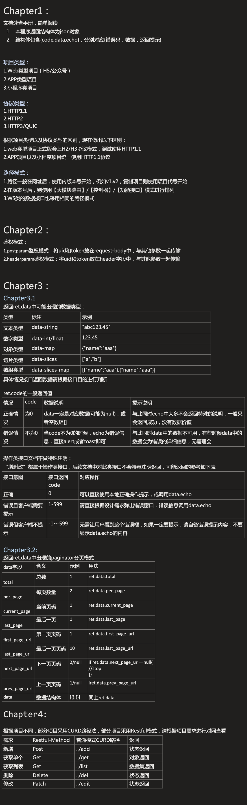

Chapter1：

文档速查手册，简单阅读

1. 本程序返回结构体为json对象

2. 结构体包含{code,data,echo}，分别对应{错误码，数据，返回提示}

项目类型：

1.Web类型项目（H5/公众号）

2.APP类型项目

3.小程序类项目

协议类型：

1.HTTP1.1

2.HTTP2

3.HTTP3/QUIC

根据项目类型以及协议类型的区别，现在做出以下区别：

1.web类型项目正式版会上H2/H3协议模式，调试使用HTTP1.1

2.APP项目以及小程序项目统一使用HTTP1.1协议

路径模式：

1.路径一般在网址后，使用内版本号开始，例如v1,v2，复制项目则使用项目代号开始

2.在版本号后，则使用【大模块路由】/【控制器】/【功能接口】模式进行排列

3.WS类的数据接口也采用相同的路径模式

Chapter2：

鉴权模式：

1.postparam鉴权模式：将uid和token放在request-body中，与其他参数一起传输

2.headerparam鉴权模式：将uid和token放在header字段中，与其他参数一起传输

Chapter3：

Chapter3.1

返回ret.data中可能出现的数据类型：

类型	标注	示例

文本类型	data-string	"abc123.45"

数字类型	data-int/float	123.45

对象类型	data-map	{"name":"aaa"}

切片类型	data-slices	["a","b"]

数组类型	data-slices-map	[{"name":"aaa"},{"name":"aaa"}]

具体情况接口返回数据请根据接口目的进行判断

ret.code的一般返回值

情况	code	数据说明	提示说明

正确情况	为0	data一定是对应数据(可能为null)，或者空数组[]	与此同时echo中大多不会返回特殊的说明，一般只会返回成功，没有数据价值

错误情况	不为0	当code不为0的时候，echo为错误信息，直接alert或者toast即可	与此同时data中的数据不可用，有些时候data中的数据会为错误的详细信息，无需理会

操作类接口文档不做特殊注明：

“增删改”都属于操作类接口，后续文档中对此类接口不会特意注明返回，可能返回的参考如下表

接口意图	接口返回code	对应操作

正确	0	可以直接使用本地正确操作提示，或调用data.echo

错误且客户端需要提示	1-599	请直接根据设计需求弹出错误窗口，错误信息调用data.echo

错误但客户端不提示	-1~-599	无需让用户看到这个错误框，如果一定要提示，请自备错误提示内容，不要显示data.echo的内容

Chapter3.2:

返回ret.data中出现的paginator分页模式

data字段	含义	示例	用法

总数	1	ret.data.total

total

每页数量	2	ret.data.per_page

per_page

当前页码	1	ret.data.current_page

current_page

最后一页	1	ret.data.last_page

last_page

第一页页码	1	ret.data.first_page_url

first_page_url

最后一页页码	10	ret.data.last_page_url

last_page_url

下一页页码	2/null	if ret.data.next_page_url==null{

next_page_url			//stop

}}

上一页页码	1/null	iret.data.prev_page_url

prev_page_url

data	数据结构体	[{},{}]	同上ret.data

Chapter4:

根据项目不同，部分项目采用CURD路径法，部分项目采用Restful模式，请根据项目需求进行对照查看

需求	Restful-Method	普通模式CURD路径	返回

新增	Post	../add	状态返回

获取单个	Get	../get	对象返回

获取列表	Get	../list	数据集返回

删除	Delete	../del	状态返回

修改	Patch	../edit	状态返回

