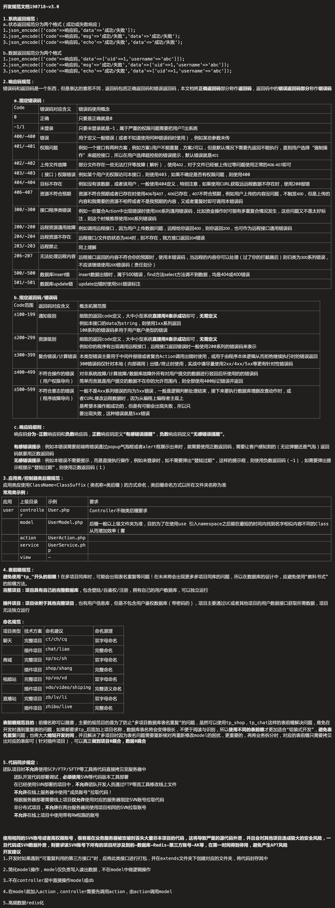

开发规范文档190718-v3.0
 
1.系统返回规范：
a.状态返回规范分为两个格式（成功或失败响应）
1.json_encode(['code'=>响应码,'data'=>'成功/失败']);
2.json_encode(['code'=>响应码,'msg'=>'成功/失败','data'=>'成功/失败');
3.json_encode(['code'=>响应码,'echo'=>'成功/失败','data'=>'成功/失败');
 
b.数据返回规范分为两个格式
1.json_encode(['code'=>响应码,'data'=>['uid'=>1,'username'=>'abc']]);
2.json_encode(['code'=>响应码,'msg'=>'成功/失败','data'=>['uid'=>1,'username'=>'abc']);
3.json_encode(['code'=>响应码,'echo'=>'成功/失败','data'=>['uid'=>1,'username'=>'abc']);
 
2.响应码规范：
错误码和返回码是一个东西，但是表达的意思不同，返回码包括正确返回码和错误返回码，本文档将正确返回码部分称作返回码，返回码中的错误返回码部分称作错误码
 
	a.固定错误码：
	Code	错误码对应含义	错误码使用概念
	0	正确	只要是正确就是0
	-1/1	未登录	只要未登录就是-1，属于严重的权限问题需要把用户T出系统
	400/-400	错误	用于定义一般错误（或者不知道使用何种错误码时使用），例如某些参数未传
	401/-401	权限问题	例如一个接口有两种方案，例如方案1用户不能重复，方案2可以，但是默认情况下需要先返回不能执行，直到用户选择“强制操作”来超控接口，所以在用户选择超控前的错误提示，默认错误就是401
	402/-402	上传文件故障	部分文件存在一些无法打开等故障（解析），使用402，对于文件已经被上传过等问题使用正常的406-407即可
	403/-403	（接口）权限错误	例如某个用户无权限访问本接口，则使用403，如果不确定是否有权限问题，则使用400
	404/-404	目标不存在	例如没有该数据，或者该用户，一般使用404定义，特别注意，如果使用CURL获取远远程数据不存在时，使用200报错
	406-407	资源不符合预期	资源不符合预期或者已存在时使用406与407，406已存在，407不符合预期，例如用户上传的内容没问题，不触发400，但是上传的内容和我需要的资源不相符或者不是我预期的内容，又或者重复时即可调用本错误码
	300/-300	接口程序类错误	例如一些复合Action中出现错误时使用300系列通用错误码，比如资金操作时可能有多重复合情况发生，这些问题又不是太好标注，则这个时候推荐使用300系列错误码
	200/-200	远程资源通用故障	例如调用远程接口，因为用户上传数据问题，远程给你返回400，则你返回200，也可作为远程接口通用错误码
	204/-204	远程资源不存在	远程接口/文件的状态为404时，则不存在，我方接口返回204错误
	203/-203	远程禁止	同上理解
	206-207	无法处理远程内容	远程接口返回的内容不符合你的预期时，使用本错误码，当远程的内容你可以处理（过了你的拦截器后）则归类为300系列错误，不应该继续使用200错误码（责任划分）
	500/-500	数据库insert错	insert数据出错时，属于500错误，find方法select方法调不到数据，均是404或400错误
	501/-501	数据库update错	update出错时使用501错误标注
 
	b.指定返回码/错误码
	Code范围	返回码对应含义	概念拓展范围
	±100-199	通知级别	细致的返回code定义，大中小型系统直接用0表示成功即可，无需定义
			例如本接口的data为string，则使用1xx系列返回
			100系列的错误码多用于用户账户类型的错误
	±200-299	资源级别	细致的返回code定义，大中小型系统直接用0表示成功即可，无需定义
			例如你的程序有出现调用远程接口，远程接口返回错误时一般使用200系列的错误码来表示
	±300-399	复合错误/计算错误	本类型错误主要用于中间件报错或者复合Action调用出错时使用，或用于由程序本体逻辑从而拒绝继续执行时的错误返回
			300错误码仅针对本地（内部调用）出错/终止时使用，实战中请尽量使用2xx/4xx/5xx等更有针对性错误码
	±400-499	不符合操作的错误	对非系统故障/计算故障/数据库故障外所有对用户提交的数据进行驳回后所使用的的错误码
		（用户权限导向）	简单而言就是用户提交的数据不在你的允许范围内，则全部使用400标记错误并返回
	±500-599	不符合意志的错误	一般不是4xx系列错误的均为5xx错误，一般是逻辑判断处理结束，接下来要执行数据库增删改查动作时，或
		（程序故障导向）	者CURL修改远程数据时，因为从编程上编程者主观上
			是希望本操作能成功的，但是有可能会出现失败，所以只
			要出现失败，这种错误就是5xx错误
 
	c.响应码细则：
	响应码分为-正数响应码和负数响应码，正数响应码定义“有感错误提醒”，负数响应码定义“无感错误提醒”。
	 
	有感错误提示：例如本错误需要前端将错误通过popup气泡框或者alert框展示出来时，就需要使用正数返回码，需要让客户感知到的（无论弹窗还是气泡）返回码就要用正数返回码
	无感错误提示：例如本错误不需要提示，而是直接执行操作，例如未登录时，如不需要弹出“登陆过期”，这样的提示框，则使用负数返回码（-1），如需要弹出提示框提示“登陆过期”，则使用正数返回码（1）
	 
3.应用类/控制器类后缀规范：
应用类应使用ClassName+ClassSuffix（类名称+类后缀）的方式命名，类后缀命名方式以所在文件夹名称为准
常用类示例：
应用	上级目录	示例	要求
user	controller	User.php	Controller不做类后缀要求
	model	UserModel.php	后缀一般以上级文件夹为准，目的为了在使用use 引入namespace之后能在最短的时间内找到名字相似内容不同的Class从而增加效率（雾
	action	UserAction.php	
	service	UserService.php	
	view	-	
 
4.表前缀规范：
避免使用"tp_"开头的前缀！在多项目同库时，可能会出现表名重复等问题！在未来将会出现更多多项目同库的问题，所以在数据库的设计中，应避免使用“教科书式”的前缀方法。
完整项目：项目具有自己的完整数据库，包含登陆/自鉴权/注册，拥有自己的用户数据库，可以独立运行
 
插件项目：项目依附于其他完整项目，也有用户信息库，但是不包含用户鉴权数据库（带密码的），项目主要通过UC或者其他项目的用户数据接口获取所需数据，项目无法独立运行
 
命名规范：
项目类型	技术方案	命名建议	命名原理
聊天	完整项目	ct/ch/cq	双字母命名
	插件项目	chat/liao	完整命名
商城	完整项目	sp/sc/sh	双字母命名
	插件项目	shop/shang	完整命名
视频站	完整项目	sp/vo/vd	双字母命名
	插件项目	vdo/video/shiping	完整语义命名
直播站	完整项目	zb/lv/li	双字母命名
	插件项目	zhibo/live	完整命名
 
表前缀规范目的：前缀名称可以随意，主要的规范目的是为了防止“多项目数据库表名重复”的问题，虽然可以使用tp_shop，tp_chat这样的表前缀解决问题，难免在开发时遇到重复表的问题，如果都要求tp_后面加上项目名称，数据库表名将会变得很长，不便于阅读与识别，所以使用不同的表前缀才更加适合“组装式开发”，避免表名重复问题，也将大大缩短开发时间，并且解决了多项目时因为表名问题需要重新核对再重新修改model的困扰，更重要的，再将业务拆分时，对应的表前缀只需要拷贝出对应的表即可（针对插件项目），可以真正做到项目0耦合，数据0耦合
 
 
 
5.代码同步规定：
团队项目时不允许使用SCP/FTP/SFTP等工具将代码直接拷贝至服务器中
	团队开发代码部署调试，必须使用SVN等代码版本工具部署
	在已经使用SVN部署的项目中，不允许团队开发人员通过FTP等流工具修改线上文件
	不允许在线上服务器中使用“成员账号”拉取代码！
	根据服务器部署需要线上项目仅允许使用对应的服务器指定SVN账号拉取代码
	非分布式项目，不允许在两台服务器间使用项目相同的SVN拉取账号
	不允许在线上项目中使用带有RW权限的账号
	 
	 
	 
使用相同的SVN账号或者高权限账号，很容易在业务服务器被攻破时丢失大量非本项目的代码，这将导致严重的源代码外泄，并且会对其他项目造成极大的安全风险，一旦代码或SVN数据外泄，则要求该SVN账号下所有的项目所涉及到的-数据库-Redis-第三方账号-AK等，在第一时间得到停用，避免产生APT风险
开发建议
1.开发时如果遇到“可重复利用的第三方接口”时，应将此类接口进行打包，并在extends文件夹下创建对应的文件夹，将代码封存其中
 
2.简化model操作，model仅负责写入读出数据，不在model中做逻辑操作
 
3.不在controller层中直接操作model或db
 
4.在model前加入action，controller需要先调用action，由action调用model
 
5.高频数据redis化

前端沟通/v1.md:2
id
vue restful api
		if c.Request.Method == "OPTIONS" {
			c.AbortWithStatus(http.StatusNoContent)
			return
		}
		//c.Header("Access-Control-Allow-Credentials", "true")
		if c.Request.Method == "OPTIONS" {
			c.AbortWithStatus(http.StatusNoContent)
			return
		}
		if c.Request.Method == "OPTIONS" {
			c.AbortWithStatus(http.StatusNoContent)
		}
 c.Request.Method
		if method == "OPTIONS" {
			c.AbortWithStatus(http.StatusNoContent)
		}
	c.Header("Access-Control-Allow-Origin", "*")
	c.Header("S-P-I", c.ClientIP())
	c.Header("S-P-H", c.Request.Host)
	c.Header("S-P-P", app_conf.Project)
	c.Header("S-P-M", app_conf.AppMode)
	c.Header("S-V-L", app_conf.Version_lowest)
	c.Header("S-V-C", app_conf.Version_current)
	c.Header("S-V-ED", app_conf.Version_end_date)
		header_handler(c)

	route.Use(BaseController.LoginedController())

header
		version1.Any("/", func(context *gin.Context) {
			context.String(0, version1.BasePath())
		})
 c.Request.Host
LectureRouter
password
PostLength