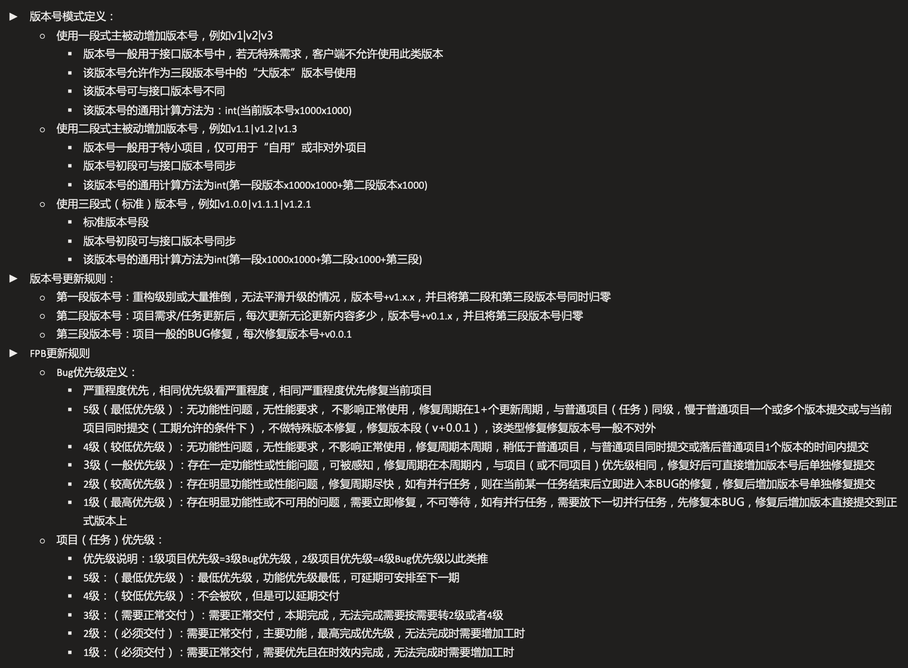

# 需求/项目/BUG管理

	► 版本号模式定义：
		○ 使用一段式主被动增加版本号，例如v1|v2|v3
			§ 版本号一般用于接口版本号中，若无特殊需求，客户端不允许使用此类版本
			§ 该版本号允许作为三段版本号中的“大版本”版本号使用
			§ 该版本号可与接口版本号不同
			§ 该版本号的通用计算方法为：int(当前版本号x1000x1000)
		○ 使用二段式主被动增加版本号，例如v1.1|v1.2|v1.3
			§ 版本号一般用于特小项目，仅可用于“自用”或非对外项目
			§ 版本号初段可与接口版本号同步
			§ 该版本号的通用计算方法为int(第一段版本x1000x1000+第二段版本x1000)
		○ 使用三段式（标准）版本号，例如v1.0.0|v1.1.1|v1.2.1
			§ 标准版本号段
			§ 版本号初段可与接口版本号同步
			§ 该版本号的通用计算方法为int(第一段x1000x1000+第二段x1000+第三段)
	► 版本号更新规则：
		○ 第一段版本号：重构级别或大量推倒，无法平滑升级的情况，版本号+v1.x.x，并且将第二段和第三段版本号同时归零
		○ 第二段版本号：项目需求/任务更新后，每次更新无论更新内容多少，版本号+v0.1.x，并且将第三段版本号归零
		○ 第三段版本号：项目一般的BUG修复，每次修复版本号+v0.0.1
	► FPB更新规则
		○ Bug优先级定义：
			§ 严重程度优先，相同优先级看严重程度，相同严重程度优先修复当前项目，红1任务（1级严重1级最优先）
			§ 严重程度一般为1或者3，只有紧急或不紧急，线上任务一般均为1
			§ 5级（最低优先级）：无功能性问题，无性能要求， 不影响正常使用，修复周期在1+个更新周期，与普通项目（任务）同级，慢于普通项目一个或多个版本提交或与当前项目同时提交（工期允许的条件下），不做特殊版本修复，修复版本段（v+0.0.1），该类型修复修复版本号一般不对外
			§ 4级（较低优先级）：无功能性问题，无性能要求，不影响正常使用，修复周期本周期，稍低于普通项目，与普通项目同时提交或落后普通项目1个版本的时间内提交
			§ 3级（一般优先级）：存在一定功能性或性能问题，可被感知，修复周期在本周期内，与项目（或不同项目）优先级相同，修复好后可直接增加版本号后单独修复提交
			§ 2级（较高优先级）：存在明显功能性或性能问题，修复周期尽快，如有并行任务，则在当前某一任务结束后立即进入本BUG的修复，修复后增加版本号单独修复提交
			§ 1级（最高优先级）：存在明显功能性或不可用的问题，需要立即修复，不可等待，如有并行任务，需要放下一切并行任务，先修复本BUG，修复后增加版本直接提交到正式版本上
		○ 项目（任务）优先级：
			§ 优先级说明：1级项目优先级=3级Bug优先级，2级项目优先级=4级Bug优先级以此类推，相同项目优先修复Bug，不同项目按照优先级对照
			§ 5级：（最低优先级）：最低优先级，功能优先级最低，可延期可安排至下一期
			§ 4级：（较低优先级）：不会被砍，但是可以延期交付
			§ 3级：（需要正常交付）：需要正常交付，本期完成，无法完成需要按需要转2级或者4级
			§ 2级：（必须交付）：需要正常交付，主要功能，最高完成优先级，无法完成时需要增加工时
			§ 1级：（必须交付）：需要正常交付，需要优先且在时效内完成，无法完成时需要增加工时
